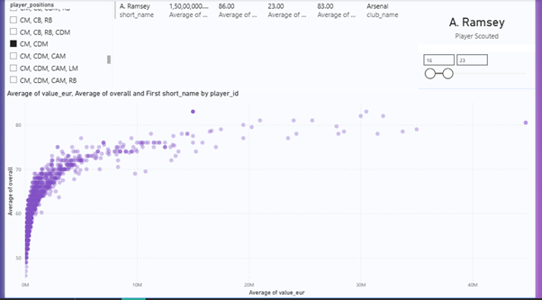

# ⚽ ProScout U23 Analytics: The "Hidden Gem" Pipeline

## 🎯 Project Objective
The goal was to solve a real-world scouting problem: Find a high-potential CM/CDM replacement under the age of 23 with a budget cap of **€15M**.

## 🛠️ Tech Stack
- **Python:** Data cleaning and ETL (Extract, Transform, Load).
- **MySQL:** Relational database for structured data storage.
- **Power BI:** Interactive visualization and business intelligence.

## 📊 The Dashboard

## 💡 Key Technical Solutions
- **Handling Dirty Data:** Resolved duplicate player entries across game versions by implementing **Average Aggregation** for ratings and values.
- **Automated Pipeline:** Built a Python script using `SQLAlchemy` to move 19,000+ records from CSV to a local MySQL instance.
- **Advanced Visualization:** Created a "Value vs. Performance" scatter plot with dynamic slicers for real-time scouting.

## 🏆 Final Recommendation
Based on the data, **A. Ramsey** was identified as the primary target, offering an elite **83 OVR** for only **€15M**, fitting perfectly within the club's financial constraints.
